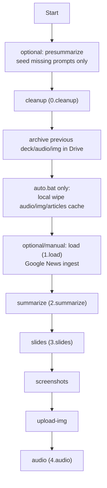
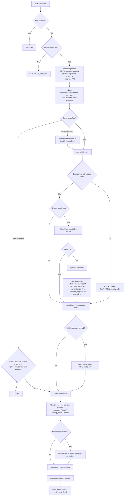

# Coffee Grinder Pipeline Diagram (current state)

## 1) Актуальный порядок шагов

Есть два практических режима запуска:

- Ручной/операторский:
  - `npm run presummarize`
  - `npm run cleanup`
  - `npm run load` при необходимости
  - `npm run summarize`
  - `npm run slides`
  - `npm run screenshots`
  - `npm run upload-img`
  - `npm run audio`
- Автоматический через `auto.bat`:
  - `cleanup`
  - локальная очистка `audio/*.mp3`, `img/*.jpg`, `img/screenshots.txt`, `articles/*.txt/html`
  - `summarize`
  - `slides`
  - `screenshots`
  - `upload-img`
  - `audio`

Важно:

- `presummarize` сейчас не входит в `auto.bat`
- `load auto` в `auto.bat` по-прежнему закомментирован
- `presummarize` только досеивает отсутствующие prompt rows в таб `prompts`; существующие тексты prompt'ов он не перезаписывает

## 2) Что реально делает `cleanup`

`cleanup` больше не чистит дополнительные колонки безусловно.

Текущие правила для колонок:

- если есть ссылка на статью и заполнены `title` + `summary`, дополнительные колонки сохраняются
- если ссылки нет, дополнительные колонки очищаются
- если одновременно пусты `title` и `summary`, дополнительные колонки очищаются
- промежуточные строки не добиваются и не чистятся автоматически

Под дополнительными колонками здесь понимаются:

- `agency`
- `factsRu`
- `arguments`
- `videoUrls`
- `date`
- `alternativeUrls`
- `usedUrl`
- `duplicateUrl`

Дополнительно `cleanup`:

- нормализует headers
- чистит legacy-поле `talkingPointsRu`
- архивирует предыдущую презентацию и live-папки `audio` / `img` в Google Drive

## 3) Детальная схема `summarize`

### Что важно в текущей логике `summarize`

- `titleEn` теперь считается частью `processingNeeds`
- если пуст только `titleEn`, пайплайн не пересобирает `summary`, `facts`, `arguments`, `videos`
- если пуст только `summary`, пайплайн не пересобирает уже заполненные `factsRu`, `arguments`, `videoUrls`
- если у строки уже есть `title` и `summary`, повторная попытка найти `videoUrls` не делается
- при смене `usedUrl` строка принудительно сбрасывает `summary`, `factsRu`, `arguments`, `videoUrls`, `date`, `agency`

## 4) Что именно делают enrichment-ветки

### Summary

- генерируется через `src/ai.js`
- результат: `titleRu`, `summary`, `topic`, `priority`
- в конце `summary` всегда проходит через авто-атрибуцию по `agency`

### Facts

- вызываются через `src/enrich.js` -> `collectFacts`
- идут через `Responses API` + `web_search`
- модель теперь просится вернуть структурированный JSON:
  - `facts: [{ fact, sourceUrl }]`
- в таблицу записывается только `fact`
- `sourceUrl` нужен как структурный выход модели, но в `factsRu` не сохраняется
- пост-очистка хвостов и ссылок оставлена как guardrail

### Talking points

- вызываются через `src/enrich.js` -> `collectTalkingPoints`
- идут через `Responses API` с `file_search + web_search`
- сохраняются в `arguments`

### Videos

Текущая стратегия в `src/video-links.js`:

1. exact article HTML -> поиск YouTube embed на самой странице статьи  
2. YouTube API, если включён  
3. YouTube RSS по trusted channels  
4. YouTube/open search ветки  
5. GPT web search  
6. trusted page candidates через current flow / search fallbacks

Дополнительные правила:

- сначала используются original article title и URL slug, keywords только как fallback-сигнал
- все кандидаты проходят relevance verify
- перед выбором проверяется доступность ролика
- недоступный ролик не блокирует дальнейший поиск альтернатив
- сохраняются только прямые YouTube video URLs

## 5) Текущие внешние сервисы и назначение

| Сервис | Где используется | Для чего | Retry / notes |
|---|---|---|---|
| Google Sheets API | `store.js`, `prompts.js`, `screenshots.js` | `news`, `prompts`, screenshot logs | Явных retry почти нет |
| Google Slides API | `google-slides.js` | deck creation/update | retry на `batchUpdate` при `429` |
| Google Drive API | `cleanup`, `upload-img`, `audio`, `google-slides` | архив и upload папок/файлов | без выраженного retry-оркестратора |
| Google News | `google-news.js` | decode `gnUrl` | до 5 попыток |
| Bright Data SDK | `brightdata-unlocker.js`, `brightdata-article.js`, `screenshots.js` | exact article HTML, screenshot fallback | используется Web Unlocker / Scrape API; Crawling API не используется |
| EventRegistry / newsapi.ai | `newsapi.js` | article info/date, current alternatives, event duplicates | остаётся как более поздний fallback |
| OpenAI Chat Completions | `ai.js`, `screenshots.js` | summary, vision fallback | без общего retry-оркестратора |
| OpenAI Responses API | `enrich.js`, `video-links.js` | facts, title lookup, arguments, alternative URL lookup, GPT video web search | без общего retry-оркестратора |
| YouTube Data API | `video-links.js` | channel/video search | transient retry x1 |
| YouTube RSS | `video-links.js` | latest channel videos | transient retry x1 |
| SerpAPI | `video-links.js` | trusted page candidate lookup | retry x1; при `429` может отключаться на run |
| Playwright | `screenshots.js` | render + screenshot | layered recovery logic |
| ElevenLabs | `eleven.js` | TTS audio | per-row error does not kill full run |

## 6) Валидаторы и фильтры

| Блок | Что сейчас проверяется | Где |
|---|---|---|
| Row gating | `topic=other`, `already_complete`, duplicate rows in current run | `2.summarize.js` |
| Video refill gating | пустой `videoUrls` игнорируется для finished rows (`title + summary`) | `2.summarize.js` |
| Cache reuse | cache принимается только если cache URL совпадает с ожидаемым URL | `2.summarize.js` |
| Agency fallback | сначала extract/EventRegistry, потом domain mapper, потом raw hostname | `2.summarize.js`, `summary-attribution.js`, `config/agencies.js` |
| Date normalization | `publishedAt`/extract/date lookup -> recent normalization | `2.summarize.js`, `video-links.js` |
| Facts normalization | из результата вырезаются URL/citation tails/source noise | `2.summarize.js` |
| Arguments normalization | приводятся к 5 блокам без мусорного форматирования | `2.summarize.js` |
| Video candidate validation | trusted domains, allowlist/exclude, date window, relevance verify, availability check | `video-links.js` |
| Summary attribution | финальная фраза добавляется автоматически через `agency` | `summary-attribution.js` |
| Duplicate marking | группы дублей по `usedUrl/url` | `2.summarize.js`, `3.slides.js`, `screenshots.js` |

## 7) Промпты и где они живут

Источник prompt'ов:

- primary source at runtime: Google Sheet tab `prompts`
- fallback seed source: `grinder/config/prompts.seed.js`

`presummarize` только добавляет отсутствующие prompt names. Он не синхронизирует и не обновляет уже существующий текст.

| Prompt name | Где вызывается | Назначение |
|---|---|---|
| `summarize:summary` | `src/ai.js` | `titleRu`, `summary`, `topic`, `priority` |
| `summarize:facts` | `src/enrich.js` | facts JSON with `fact/sourceUrl` |
| `summarize:arguments` | `src/enrich.js` | talking points |
| `summarize:videos` | `src/video-links.js` | GPT web search video candidates |
| `summarize:title-by-url` | `src/enrich.js` | `titleEn/titleRu` lookup by URL |
| `summarize:fallback-keywords` | `src/fallback-keywords.js` | fallback keyword selection |
| `summarize:alternative-url-search` | `src/enrich.js` | GPT lookup of alternative agency URLs |

Inline prompts:

- video relevance verify prompt in `src/video-links.js`
- GPT vision prompt in `src/screenshots.js`

## 8) Что сохраняется после этапов

- `cleanup`:
  - приводит таблицу к чистому состоянию по текущим правилам
  - архивирует прошлую презентацию и live-папки
- `summarize`:
  - обновляет только реально missing поля
  - пишет/обновляет articles cache
  - в конце проставляет `duplicateUrl`, сортирует и сохраняет sheet
- `slides`:
  - создаёт/обновляет deck
  - пишет `img/screenshots.txt`
- `screenshots`:
  - рендерит `img/*.jpg`
  - логирует проблемные кадры
- `upload-img`:
  - архивирует прошлую live image folder и загружает текущую
- `audio`:
  - генерирует mp3 для строк с `sqk + summary`
  - архивирует прошлую live audio folder и загружает текущую
