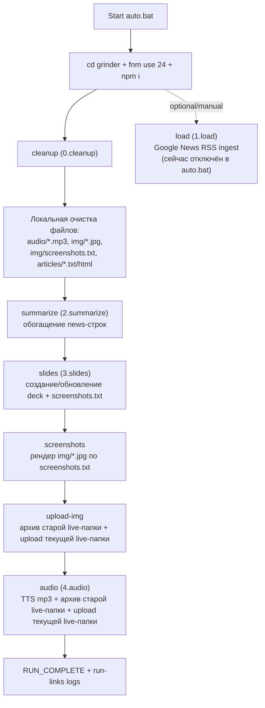
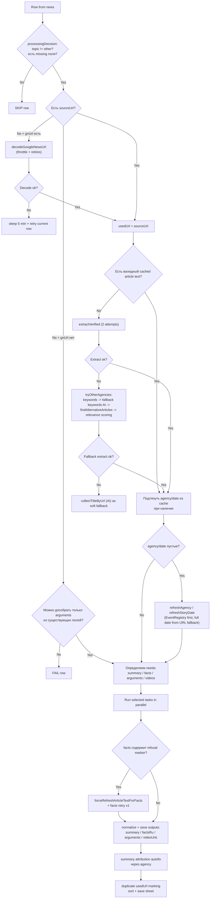

# Coffee Grinder Pipeline Diagram (auto.bat oriented)

## 1) Порядок шагов и суть выполнения

Важно: в текущем `auto.bat` шаг `npm run load auto` закомментирован, поэтому фактический auto-run идет без стадии `load`.

Кратко по шагам:
- `cleanup`: очищает служебные колонки в `news`, сохраняет таблицу и архивирует предыдущую презентацию/папки `audio`/`img` в archive folder.
- `summarize`: для строк из `news` решает, что надо достроить (`summary`, `agency`, `factsRu`, `arguments`, `videoUrls`, `date`, `usedUrl`), использует cache статьи, извлекает текст, затем запускает AI/видео-обогащение.
- `slides`: формирует слайды, проставляет `sqk`, пишет `../img/screenshots.txt`, чистит незаполненные карточки.
- `screenshots`: открывает URL, лечит overlay/paywall/consent/captcha сценарии (known fixes -> GPT vision -> Bright Data fallback), сохраняет `img/*.jpg`.
- `upload-img`: архивирует предыдущую live-папку `img` в Drive и загружает текущую live-папку.
- `audio`: генерирует mp3 через ElevenLabs, архивирует предыдущую live-папку `audio` и загружает текущую live-папку.

## 2) Детальная схема `summarize`

## 3) 3rd-party сервисы, назначение и retry-политики

| Сервис | Где используется | Для чего | Retry / attempts |
|---|---|---|---|
| Google Sheets API | `store.js`, `prompts.js`, `screenshots.js` | Загрузка/сохранение `news`, `prompts`, лог фейлов скриншотов | Явных retry нет |
| Google Slides API | `google-slides.js` | Создание/обновление презентации, очистка placeholders | `batchUpdateWithRetry`: до 6 попыток при 429, exponential backoff |
| Google Drive API | `cleanup`, `upload-img`, `audio`, `google-slides` | Архивация и загрузка папок/файлов | Явных retry нет |
| Google News (`news.google.com`) | `google-news.js` | Декодирование `gnUrl` в исходный URL статьи | До 5 попыток |
| EventRegistry / newsapi.ai API | `newsapi.js` | `extractArticleInfo`, `extractArticleDate`, альтернативные статьи, дубликаты, события | Retry нет; timeout на запрос около 10s |
| Прямой HTTP к статье | `fetch-article.js` | Фоллбек-извлечение HTML статьи | 2 попытки |
| OpenAI Chat Completions | `ai.js`, `fallback-keywords.js`, `video-links.js`, `screenshots.js` | Summary, fallback keywords, video relevance verify, GPT vision action | Retry нет |
| OpenAI Responses API | `enrich.js`, `video-links.js` | Facts / title lookup / arguments / GPT web-search for videos | Retry нет |
| YouTube Data API v3 | `video-links.js` | Каналы/плейлисты/поиск видео | Transient retry x1 (429/5xx/timeout) |
| YouTube RSS | `video-links.js` | Фоллбек получения свежих видео | feed/channel transient retry x1 |
| SerpAPI | `video-links.js` | Поиск trusted page candidates | Retry x1 на transient/timeout; при 429 сервис отключается на run + cooldown |
| Bright Data Web Unlocker | `brightdata-unlocker.js`, `screenshots.js` | Разблокировка HTML/скриншот-фоллбек для проблемных страниц | HTML: raw -> json fallback; screenshot: 2 попытки (30s -> 45s timeout) |
| Playwright | `screenshots.js` | Рендер страниц и скриншоты | `safeEvaluate` до 3 попыток; known-fix passes = 2 |
| ElevenLabs | `eleven.js` | Генерация mp3 озвучки | Retry нет (ошибка логируется, пайплайн продолжает) |

## 4) Валидаторы, фильтры и доп. обработка

| Блок | Что валидируется/фильтруется | Где |
|---|---|---|
| Row gating | `topic=other` и полностью заполненные строки пропускаются | `2.summarize.js` (`processingDecision`) |
| Dedup внутри run | Повторы по `url/usedUrl/gnUrl` пропускаются в текущем запуске | `2.summarize.js` |
| Article cache | cache статьи принимается только если `URL` из cache совпадает с ожидаемым URL | `2.summarize.js` |
| Date normalization | Приоритет: `publishedAt` из extract/EventRegistry -> полная дата из URL; только в окне `сегодня ±5d` | `2.summarize.js`, `video-links.js` |
| Agency resolution | Сначала EventRegistry/source title, потом доменный mapper, потом hostname | `newsapi.js`, `summary-attribution.js`, `config/agencies.js` |
| Facts normalization | Удаление буллетов, URL, `||source`, refusal marker | `2.summarize.js` |
| Arguments normalization | Очистка форматирования + limit до 5 пунктов | `2.summarize.js` |
| Video URL sanitizer | Сохраняются только прямые YouTube video URLs | `2.summarize.js`, `video-links.js` |
| Summary attribution | Автодобавление финальной фразы через `agency` с несколькими формулировками | `summary-attribution.js` |
| Duplicate URL marking | Группы дублей по `usedUrl/url` | `2.summarize.js`, `3.slides.js`, `screenshots.js` |
| Topic normalization | Aliases/normalization для topic map | `config/topics.js`, `3.slides.js` |
| Видео-кандидаты | trusted domains, date window, keyword hits, channel excludes/allowlist, verify confidence >= 0.70 | `video-links.js` |
| Screenshot health checks | headline/source/overlay/captcha/paywall/content check + final quality checklist | `screenshots.js` |
| Safety guard (vision) | GPT action whitelist и безопасные селекторы/тексты | `screenshots.js` |

## 5) Отсылки к промптам

Источник промптов: Google Sheet tab `prompts`; если строка отсутствует, автоматически seed из `grinder/config/prompts.seed.js`.

| Prompt name | Где вызывается | Назначение |
|---|---|---|
| `summarize:summary` | `src/ai.js` | Генерация `titleRu`, `summary`, `topic`, `priority` |
| `summarize:facts` | `src/enrich.js` (`collectFacts`) | Дополняющие факты по статье |
| `summarize:arguments` | `src/enrich.js` (`collectTalkingPoints`) | Аргументы / talking points для ведущего |
| `summarize:videos` | `src/video-links.js` (`searchYoutubeVideosViaGptWebSearch`) | GPT web-search кандидатов видео |
| `summarize:fallback-keywords` | `src/fallback-keywords.js` | AI-выбор fallback keywords |
| `summarize:title-by-url` | `src/enrich.js` (`collectTitleByUrl`) | Получение заголовка по URL, если текст не извлечён |

Inline prompts (не из Google Sheet):
- GPT vision prompt в `src/screenshots.js` (`askVisionAction`).
- Video verify prompt в `src/video-links.js` (`verifyVideoCandidatesRelevance`).

## 6) Решения после каждого этапа

- `cleanup`:
  - очищает значения в служебных колонках `news`, но не удаляет строки;
  - архивирует предыдущую презентацию и live-папки `audio` / `img`, если они существуют.
- `summarize`:
  - по каждой строке: `skip` / `process` / `fail`;
  - если меняется `usedUrl`, строка сбрасывается и пересобирается заново;
  - при `facts refusal marker` выполняется принудительный re-extract + 1 retry facts;
  - итог run: summary attribution autofix, duplicate marking, sort, save в Sheets, cost/api stats.
- `slides`:
  - если презентации нет, создаётся копия из template;
  - в deck идут только `topic != other` и `summary != empty`;
  - для существующей презентации берутся только строки без `sqk`.
- `screenshots`:
  - если `screenshots.txt` отсутствует, происходит graceful exit;
  - если legacy файл без metadata и override не включён, будет hard error;
  - по URL: `success/fail`; fail логируется в `screenshot_logs`.
- `upload-img`:
  - архивируется старая live-папка `img`, затем загружается текущая live-папка.
- `audio`:
  - берутся только строки с `sqk` и `summary`;
  - ошибка TTS по отдельной строке не валит весь run;
  - архивируется старая live-папка `audio`, затем загружается текущая live-папка.

## 7) Что еще стоит добавить в схему

Рекомендую добавить:
1. `SLO/временные бюджеты` по стадиям (например p95 на `summarize`, `screenshots`).
2. `Failure budget` и пороги алертов (процент fail screenshots, доля rows без summary).
3. `Data contract` по обязательным колонкам Sheets (`news`, `prompts`, `screenshot_logs`).
4. `Runbook` для типовых падений (Google auth, Bright Data limit, YouTube auth broken).
5. `Idempotency notes` (что безопасно перезапускать и какие артефакты перезаписываются).
